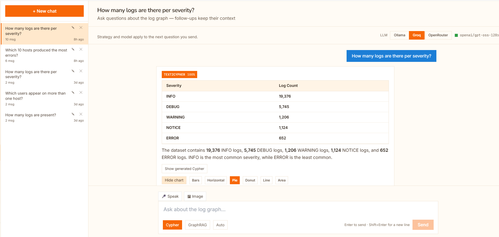

# Universal Log Pre-processing Framework (ULPF)

**Smart India Hackathon 2026** · Problem Statement by **NTRO** · Theme: Blockchain & Cybersecurity

Turns a log from *any* device into one common schema — without losing a byte of the
original, and with a hash chain that proves it was never altered afterwards.

```
firewall syslog ─┐
Okta JSON        ├─►  54 parsers  ─►  28-field schema  ─►  Neo4j  ─►  search · export · alert
Windows XML      │         │              │                  │
CEF / LEEF       │         │              │                  └─►  Merkle ledger
containerd       ┘         │              └─►  raw bytes + SHA-256 kept on every event
                           └─►  nothing recognised? structural fallback, never dropped
```

---

## Screenshots

<!-- Replace each placeholder with a real screenshot. Suggested captures are
     described so a reader knows what they are looking at even before the
     images are added. -->

### Parser Lab — paste any vendor's log, watch it parse live

> *Screenshot: `docs/screenshots/parser-lab.png`*
> Left: the raw pasted log. Right: the normalised record, with a byte-for-byte
> "preserved" check. Nothing is stored — safe to run against production.


### Analytics — volume, severity, hosts and anomalies

> *Screenshot: `docs/screenshots/analytics.png`*


### Chat — ask the graph in English, by voice, or with a screenshot

> *Screenshot: `docs/screenshots/chat.png`*
> Text-to-Cypher with the generated query shown, charts on demand, and
> speech in/out running locally.



### Integrity — seal, verify, and prove a single event

> *Screenshot: `docs/screenshots/integrity.png`*
> The head hash, a verification result, and a Merkle inclusion proof.


### Schema & export — the common taxonomy, and what it exports to

> *Screenshot: `docs/screenshots/schema-export.png`*


---

## What problem this solves

Every firewall, server, cloud service and security tool writes logs in its own
private language. Before anyone can search them, correlate them, or spot an
attack, an engineer has to hand-write a translator for each one — and that work
is repeated at every organisation.

Worse: once the logs are normalised, most pipelines can prove what they
**stored**, not that storage was never changed. In a forensic or compliance
review, the second one is what counts.

## What is actually built

| | |
|---|---|
| **54 parsers** | Cisco ASA, FortiGate, Palo Alto (CEF), Check Point (LEEF), Snort, F5, pfSense, Squid, Linux, Windows, VMware, Kubernetes, Envoy, PostgreSQL, AWS/Azure/GCP, CrowdStrike, Defender, Okta, Duo, logfmt, IoT gateways |
| **Structural fallback** | An unknown vendor still yields hostname, process, severity and key=value fields — and is never dropped |
| **Parser synthesis** | Points at unmatched lines and writes a working parser in milliseconds |
| **28-field schema** | With ECS and OCSF 1.3.0 exports |
| **Tamper-evident ledger** | Merkle hash chain; 9 sibling hashes prove one event without revealing the rest |
| **Local AI** | Text-to-Cypher, GraphRAG, speech in/out, image understanding, PPT/PDF/Word — all offline |
| **Air-gapped** | Verified with `docker run --network none` |

## Start here

| If you are… | Read |
|---|---|
| **Evaluating this for SIH** | **[docs/FOR-JUDGES.md](docs/FOR-JUDGES.md)** — a guided tour with every claim and where to check it |
| Wanting to reproduce a number | [docs/VERIFY.md](docs/VERIFY.md) — the exact command for each figure |
| Reading the design | [docs/ARCHITECTURE.md](docs/ARCHITECTURE.md) |
| Looking at the parser | [app/backend/ingestion_pipeline/README.md](app/backend/ingestion_pipeline/README.md) |
| Looking at the integrity ledger | [app/backend/analytics_pipeline/ledger/README.md](app/backend/analytics_pipeline/ledger/README.md) |

## Run it

```bash
# 1. a graph to write into
docker run -d --name neo4j -p 7687:7687 -p 7474:7474 \
  -e NEO4J_AUTH=neo4j/yourpassword neo4j:5-community

# 2. configure (each service has its own .env.example)
cp app/backend/ingestion_pipeline/.env.example app/backend/ingestion_pipeline/.env
cp app/backend/analytics_pipeline/.env.example app/backend/analytics_pipeline/.env
cp app/backend/chatbot_pipeline/.env.example   app/backend/chatbot_pipeline/.env

# 3. load some logs (sample_logs.txt is in this repo)
cd app/backend/ingestion_pipeline
pip install -r requirements.txt
python -m batch.parse_logs --path ../../../sample_logs.txt --out parsed.json
python -m batch.ingest_to_neo4j --input parsed.json

# 4. the three services
python -m uvicorn api:app --port 8020                        # ingestion
cd ../analytics_pipeline && python -m uvicorn api:app --port 8010
cd ../chatbot_pipeline   && python -m uvicorn api:app --port 8000

# 5. the UI
cd ../../frontend && npm install && npm run dev               # → localhost:5173
```

**The parser needs nothing installed.** It is pure standard library, so this
works on a bare Python 3.10+:

```bash
cd app/backend/ingestion_pipeline
python -m batch.test_custom_formats      # 50 checks
python -m batch.test_source_coverage     # 61 checks
```

## Repository map

```
sample_logs.{txt,xml,csv}      synthetic logs covering every source category
                               and format the problem statement names

app/
  backend/
    ingestion_pipeline/        parsers, schema, synthesis  ← start here
      core/parsers/            the 54 detectors
      core/parser_synth.py     writes a parser from samples
      core/parser_semantics.py infers what a synthesised field MEANS
      batch/                   CLI: parse, ingest, embed, synthesise, test
    analytics_pipeline/        aggregations, exports, integrity ledger
      ledger/                  Merkle tree + hash chain
      ocsf.py                  OCSF 1.3.0 emitter
      forwarder.py             push to syslog / HTTP / file sinks
    chatbot_pipeline/          text-to-Cypher, GraphRAG, speech, vision, docs
  frontend/                    React UI — 8 screens
docs/                          architecture, verification, judge's tour
```

## Honest scope

- **Tamper-evident, not tamper-proof.** A full chain rewrite is self-consistent; it is caught only by a head hash published outside the system.
- **OCSF covers 3 classes of ~70** — Authentication, Network Activity, Application Lifecycle.
- **Neo4j is the wrong store beyond single-VM scale.** Streaming exports to a SIEM or data lake are the scale path.
- **Semantic search runs at ~3 events/sec on CPU** and is optional per deployment.
- **The synthesiser drafts; a human still reviews.** It gets shape and most field meanings right; it does not know your business.

We would rather state the boundary than be found at it.

## Licence

See [docs/ARCHITECTURE.md](docs/ARCHITECTURE.md#licences) for every dependency
and its licence. Note that **Neo4j Community is GPLv3**, used over the Bolt
protocol via an Apache-2.0 driver.
