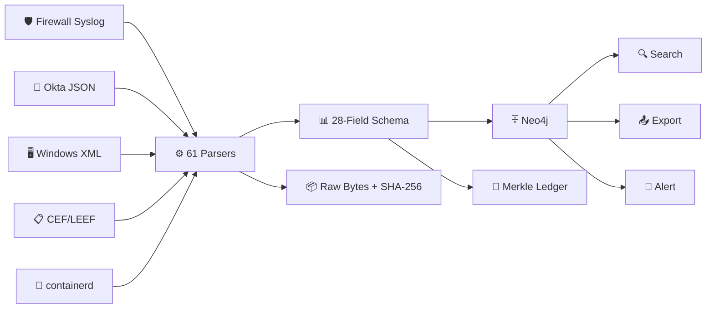
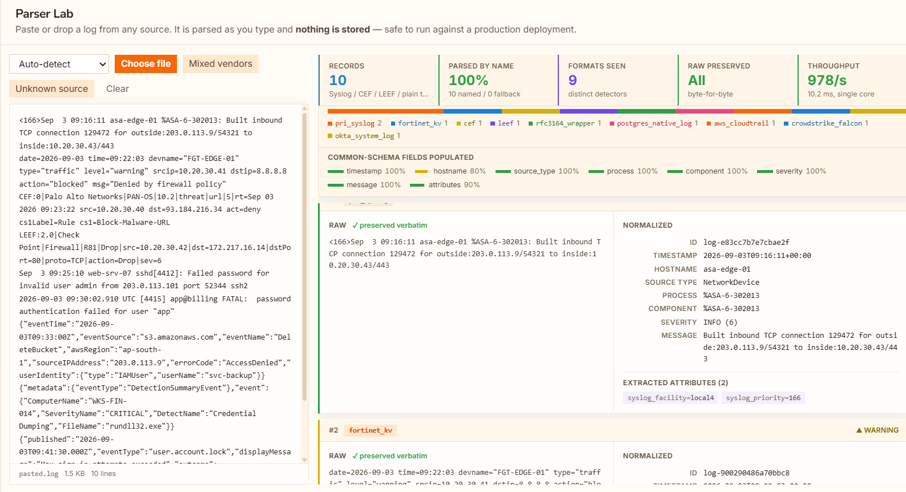
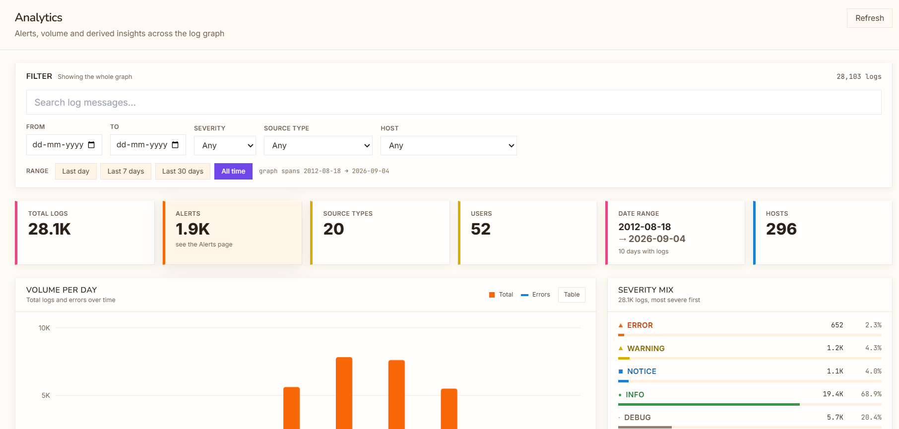
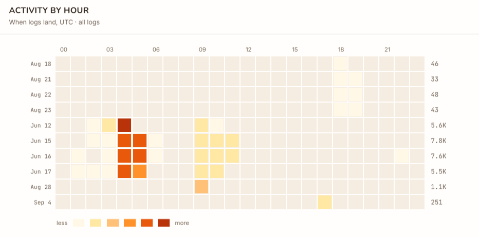
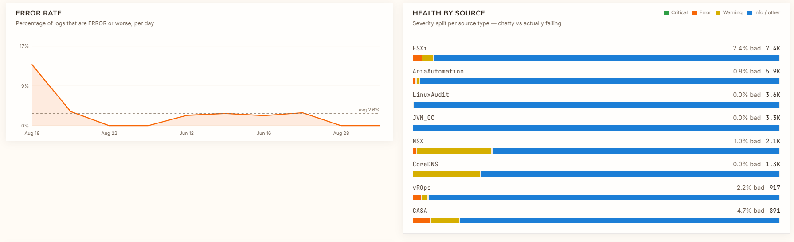
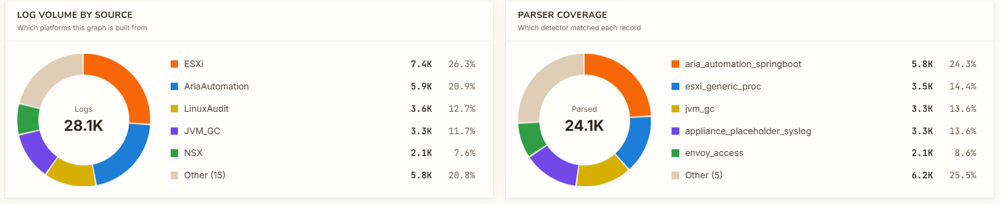
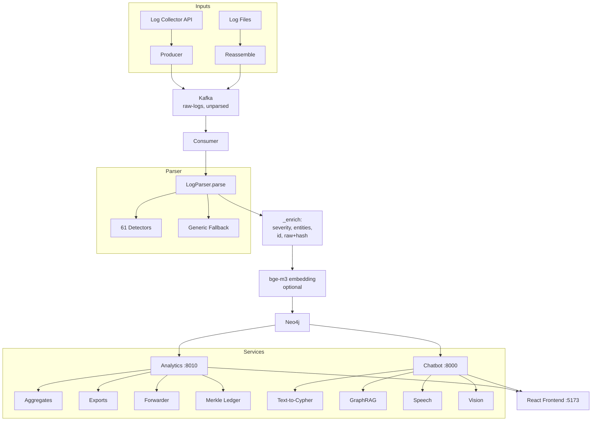

<a id="top"></a>

# Universal Log Pre-processing Framework (ULPF)

<div align="center">

**Smart India Hackathon 2026** · Problem Statement by **NTRO** · Theme: Blockchain & Cybersecurity

[](https://www.python.org/)
[](https://neo4j.com/)
[](https://reactjs.org/)
[](https://fastapi.tiangolo.com/)

</div>

> **Turns a log from *any* device into one common schema — without losing a byte of the original, and with a hash chain that proves it was never altered afterwards.**



---

## 🧭 Index

- [📸 Screenshots](#screenshots)
  - [🧪 Parser Lab](#parser-lab)
  - [💬 Chat](#chat)
  - [📈 Analytics](#analytics)
- [🎯 The Problem](#the-problem)
- [✨ What Is Actually Built](#what-is-actually-built)
- [🚀 Quick Start](#quick-start)
  - [The Parser Alone — No Installation](#the-parser-alone-no-installation)
  - [The Whole System](#the-whole-system)
  - [Air-Gapped Deployment](#air-gapped-deployment)
- [🧭 For Evaluators — A Guided Tour](#for-evaluators-a-guided-tour)
  - [The Claims, and Where Each Is Enforced](#the-claims-and-where-each-is-enforced)
  - [The Part We're Most Pleased With](#the-part-we-re-most-pleased-with)
  - [Where the Interesting Code Lives](#where-the-interesting-code-lives)
- [🏗️ Architecture](#architecture)
  - [Design Principles](#design-principles)
- [📋 The Schema](#the-schema)
  - [Traceability Fields](#traceability-fields)
- [🔗 The Tamper-Evident Ledger](#the-tamper-evident-ledger)
  - [Attack Resistance](#attack-resistance)
  - [Design Decisions Worth Defending](#design-decisions-worth-defending)
- [🧬 Parser Synthesis](#parser-synthesis)
  - [Performance](#performance)
  - [How It Works](#how-it-works)
- [🔌 Integrations](#integrations)
  - [Pull — Streaming Exports](#pull-streaming-exports)
  - [Push — `analytics_pipeline/forwarder.py`](#push-analytics-pipeline-forwarder-py)
  - [OCSF Scope (Stated Honestly)](#ocsf-scope-stated-honestly)
- [🤖 Local AI](#local-ai)
- [📊 Measured Numbers](#measured-numbers)
  - [Parsing Scales with CPU Cores](#parsing-scales-with-cpu-cores)
  - [Storage Overhead (10,000 records)](#storage-overhead-10-000-records)
  - [Air-Gap Verification](#air-gap-verification)
- [📁 Repository Map](#repository-map)
- [🎯 Honest Scope](#honest-scope)
- [📜 Licences](#licences)
- [📚 Standards Implemented](#standards-implemented)

---
<a id="screenshots"></a>

## 📸 Screenshots

<a id="parser-lab"></a>

### 🧪 Parser Lab
*Paste a log from any vendor and watch it parse live. Raw on the left, the
normalised record on the right, with a byte-for-byte **preserved** check —
and nothing is stored, so it is safe to run against production.*



---

<a id="chat"></a>

### 💬 Chat
*Ask the graph in English. Text-to-Cypher shows the query it generated, charts
are drawn on demand, and speech in/out runs locally.*


---

<a id="analytics"></a>

### 📈 Analytics
*Volume, severity, hosts and anomalies — with date-range, severity, source and
free-text filters threaded through every aggregation.*









---

<a id="the-problem"></a>

## 🎯 The Problem

Every firewall, server, cloud service and security tool writes logs in its own **private language**. Before anyone can search them, correlate them, or spot an attack, an engineer has to hand-write a translator for each one — and that work is repeated at every organisation.

**Worse:** once logs are normalised, most pipelines can prove what they *stored*, not that storage was never changed. In a forensic or compliance review, the second one is what counts.

---

<a id="what-is-actually-built"></a>

## ✨ What Is Actually Built

| | |
|---|---|
| **61 Parsers** | Cisco ASA, FortiGate, Palo Alto (CEF), Check Point (LEEF), Snort, F5 BIG-IP, pfSense, Squid, Linux syslog, Windows Security, VMware (ESXi/NSX/vCenter/vROps/Horizon), Kubernetes, Envoy, CoreDNS, PostgreSQL, AWS CloudTrail, Azure, GCP, CrowdStrike, Defender, Okta, Duo, logfmt, JVM, Apache, IoT gateways |
| **Structural Fallback** | An unknown vendor still yields hostname, process, severity and key=value fields — and is **never dropped** |
| **Parser Synthesis** | Points at unmatched lines and writes a working parser in **~3 ms** |
| **28-Field Schema** | 18 required, 0 violations on live data; ECS and OCSF 1.3.0 exports |
| **Tamper-Evident Ledger** | Merkle hash chain; 9 sibling hashes prove one event without revealing the rest |
| **Local AI** | Text-to-Cypher, GraphRAG, speech in/out, image understanding, PPT/PDF/Word — **all offline** |
| **Air-Gapped** | Verified with `docker run --network none` |

---

<a id="quick-start"></a>

## 🚀 Quick Start

<a id="the-parser-alone-no-installation"></a>

### The Parser Alone — No Installation

```bash
cd app/backend/ingestion_pipeline
python -m batch.test_custom_formats      # 50 checks
python -m batch.test_source_coverage     # 61 + 84 checks
python -m batch.test_unseen_vendors      # 28 vendors absent from fixtures
```

<a id="the-whole-system"></a>

### The Whole System

```bash
# 1. Start Neo4j
docker run -d --name neo4j -p 7687:7687 -p 7474:7474 \
  -e NEO4J_AUTH=neo4j/yourpassword neo4j:5-community

# 2. Configure services
cp app/backend/ingestion_pipeline/.env.example app/backend/ingestion_pipeline/.env
cp app/backend/analytics_pipeline/.env.example app/backend/analytics_pipeline/.env
cp app/backend/chatbot_pipeline/.env.example   app/backend/chatbot_pipeline/.env

# 3. Load logs
cd app/backend/ingestion_pipeline
pip install -r requirements.txt
python -m batch.parse_logs --path ../../../sample_logs.txt --out parsed.json
python -m batch.ingest_to_neo4j --input parsed.json

# 4. Start services
python -m uvicorn api:app --port 8020                          # ingestion
cd ../analytics_pipeline && python -m uvicorn api:app --port 8010
cd ../chatbot_pipeline   && python -m uvicorn api:app --port 8000

# 5. Launch UI
cd ../../frontend && npm install && npm run dev                # → localhost:5173
```

<a id="air-gapped-deployment"></a>

### Air-Gapped Deployment

```bash
# Build on connected machine
app/build_images.ps1

# Deploy on air-gapped
./load_images.sh && docker compose up -d
```

> ✅ **No runtime downloads, telemetry, or licence checks.**

---

<a id="for-evaluators-a-guided-tour"></a>

## 🧭 For Evaluators — A Guided Tour

<a id="the-claims-and-where-each-is-enforced"></a>

### The Claims, and Where Each Is Enforced

| Claim | Enforced In | Checked By |
|---|---|---|
| Raw bytes preserved exactly | `core/parser.py` — `raw_message`, `raw_hash` | `_check_verbatim` |
| Unknown vendor never dropped | `core/parsers/generic_fallback.py` | `_check_fallback` |
| Format detected from content, not filename | `core/structured_readers.py` | `_check_sniff` |
| CEF/LEEF timestamps normalise | `core/parsers/cef_leef.py` | `_check_cef_leef` |
| Right detector claims each format | `core/parsers/registry.py` ordering | `_check_attribution` |
| OCSF classes correct | `analytics_pipeline/ocsf.py` | `_check_ocsf` |
| Ledger detects tampering | `analytics_pipeline/ledger/` | 165 adversarial checks |

> All tests live in [`app/backend/ingestion_pipeline/batch/test_source_coverage.py`](app/backend/ingestion_pipeline/batch/test_source_coverage.py) — readable in one sitting.

<a id="the-part-we-re-most-pleased-with"></a>

### The Part We're Most Pleased With

We built **Parser Lab** to demonstrate the parser, and then tested it against vendors it had never seen. Between them they found **five real bugs in our own work**:

1. **`reassemble()` didn't know half the formats we parse** — CEF, LEEF, JSON and PRI-prefixed syslog weren't recognised as record *starts*
2. **A `.log` extension overrode the file's contents** — a CSV named `export.log` was parsed as syslog
3. **Raw was not verbatim** — `parse()` stored the *stripped* form, losing trailing whitespace
4. **A broad new detector silently stole another's lines** — adding `logfmt` took FortiGate traffic logs
5. **Our own fixtures were flattering us** — re-testing with **28 unseen vendors** dropped coverage from 97% to 75%

<a id="where-the-interesting-code-lives"></a>

### Where the Interesting Code Lives

| File | Why It Matters |
|---|---|
| `core/parser.py` | The whole normalisation path — note `stored_raw`, bound once |
| `core/parsers/generic_fallback.py` | How an *unknown* vendor still yields a usable event |
| `core/parser_synth.py` | Typed-token alignment — writes a regex from samples |
| `core/parser_semantics.py` | Infers what a synthesised field *means* |
| `core/multiline.py` | Where one record ends and the next begins |
| `analytics_pipeline/ledger/merkle.py` | RFC 6962 domain separation |
| `analytics_pipeline/ocsf.py` | Conservative classification |
| `analytics_pipeline/forwarder.py` | **At-least-once** delivery, not pretended to be exactly-once |

---

<a id="architecture"></a>

## 🏗️ Architecture

> A standalone two-page version, with the ledger, synthesis and
> deployment detail, is in **[docs/ARCHITECTURE.md](docs/ARCHITECTURE.md)**.



<a id="design-principles"></a>

### Design Principles

- **Three independent services** — ingestion *writes*, analytics and chat *read*
- **Raw is buffered before parsing** — crash recovery without data loss
- **Detector order is the most fragile thing** — hence the attribution tests
- **Record boundaries decided by signatures** — each format's detector needs one

---

<a id="the-schema"></a>

## 📋 The Schema

**28 fields, 18 required**, each carrying its ECS name and OCSF path.

<a id="traceability-fields"></a>

### Traceability Fields

| Field | Purpose |
|---|---|
| `raw_message` | The original event, byte for byte |
| `raw_hash` | SHA-256 of those bytes — **recomputable from source file without this system** |
| `id` | MD5-16 of `timestamp\|host\|process\|raw`, stable across re-ingestion |
| `matched_format` | Which detector claimed it |
| `confidence` | 1.0 vendor-specific, lower for shape matches and fallback |
| `source_file` / `source_record` | Origin file and ordinal |
| `timestamp_source` | `event` or `ingest` |
| `timestamp_anomalous` | Clock-skew flag — **flagged, never corrected** |

> `raw_hash` matters because it is verifiable *without us* — an investigator holding the original log file can recompute SHA-256 and find the matching stored event.

---

<a id="the-tamper-evident-ledger"></a>

## 🔗 The Tamper-Evident Ledger

We do **not** use a blockchain. We use the primitive underneath one.

```
event  ─► leaf   = SHA256(0x00 ‖ canonical(event))     RFC 6962 prefixes
leaves ─► root   = Merkle tree, odd nodes promoted (not duplicated)
block  ─► hash   = SHA256(header including prev_hash ‖ merkle_root)
blocks ─► chain  = each block commits to the previous
chain  ─► head   = the one value that must be protected
```

```bash
cd app/backend/analytics_pipeline
python -m ledger.demo                    # seal real logs, edit, watch it caught
python ledger/tests/test_ledger.py       # 165 adversarial checks
```

<a id="attack-resistance"></a>

### Attack Resistance

| Attack | Result |
|---|---|
| Edit a message | ❌ Caught — Merkle mismatch |
| Reorder events | ❌ Caught |
| Delete an event | ❌ Caught |
| **Re-seal the block to hide edit** | ❌ Caught — breaks link to next block |
| Re-seal the **entire** chain | ⚠️ **Not caught internally** — caught only by externally held head hash |
| Forge an inclusion proof | ❌ Rejected |

<a id="design-decisions-worth-defending"></a>

### Design Decisions Worth Defending

- **RFC 6962 domain separation** (`0x00` leaves, `0x01` nodes) — prevents second-preimage attacks
- **Odd nodes promoted, not duplicated** — avoids Bitcoin's CVE-2012-2459
- **Only nine fields are sealed** — not `processed_at` or `embedding`, which change legitimately
- **9 sibling hashes** prove one event in a 500-event block *without revealing the other 499*

> **Tamper-evident, not tamper-proof.** Publishing the head hash somewhere the operator doesn't control is what turns evidence into proof.

---

<a id="parser-synthesis"></a>

## 🧬 Parser Synthesis

```bash
python -m batch.synth_parser --file unknown.log --name acme --only-unmatched
```

<a id="performance"></a>

### Performance

| | |
|---|---|
| Before | 4/4 lines unclaimed by every registered detector |
| Synthesis | **3 ms**, confidence 0.67, **no TODO in output** |
| After | 4/4 parsed with **zero human edits** |

<a id="how-it-works"></a>

### How It Works

1. **Positional evidence** — syslog RFC 3164/5424 fix the host and program slots
2. **Key-name evidence** — vocabulary drawn from the formats our detectors already handle
3. **Value-shape evidence** — infers field *meaning* from three kinds of evidence

> It will **not** guess whether an unnamed IP is source or destination. Wrong evidence in an investigation is the failure this project exists to prevent.

---

<a id="integrations"></a>

## 🔌 Integrations

<a id="pull-streaming-exports"></a>

### Pull — Streaming Exports

NDJSON · ECS · **OCSF 1.3.0** · CEF · CSV

<a id="push-analytics-pipeline-forwarder-py"></a>

### Push — `analytics_pipeline/forwarder.py`

| Sink | For |
|---|---|
| syslog (RFC 5424 + RFC 6587 octet framing, CEF payload) | ArcSight, QRadar, appliance-era collectors |
| HTTP / NDJSON batches | Splunk HEC, Elastic, OpenSearch, Sentinel |
| Rotating NDJSON files | Object storage or data-lake loader |

> **Bounded queue, exponential backoff, dead-letter counter.** Delivery is **at-least-once** — deduplicate on the stable event `id`.

<a id="ocsf-scope-stated-honestly"></a>

### OCSF Scope (Stated Honestly)

- **Three classes implemented:** Authentication (3002), Network Activity (4001), Application Lifecycle (1008)
- Events that don't clearly belong go to 1008 rather than forced classification
- On infrastructure corpus: 95% → 1008 (correct — it's application lifecycle)
- On perimeter data: 74 / 16 / 11 split

---

<a id="local-ai"></a>

## 🤖 Local AI

Everything runs on the air-gapped box. **No cloud APIs.**

| Component | Purpose |
|---|---|
| **Ollama + Qwen3 14B** | Text-to-Cypher, GraphRAG |
| **BAAI/bge-m3** | 1024-dim embeddings, native Neo4j vector index |
| **BAAI/bge-reranker-v2-m3** | Retrieval reranking |
| **faster-whisper 1.2** | Speech to text — WER **25% → 10%** with vocabulary seeding |
| **Piper TTS 1.7** | Text to speech — ~50 MB ONNX voice |
| **minicpm-v** | Image understanding — paste a log screenshot and ask about it |
| **python-pptx / reportlab / python-docx** | "Make a 7-slide deck on the last 7 days" — native charts |

> A larger Whisper model wasn't the fix — `small` scored 15% and ran 2.5× slower. Conditioning on the vocabulary that actually occurs was.

---

<a id="measured-numbers"></a>

## 📊 Measured Numbers

**Intel i5-12450H, 8 cores / 12 threads, no GPU, Python 3.11**

| Metric | Value | Condition |
|---|---|---|
| **3,513 events/sec** | normalisation | 1 core, parse stage only |
| **16,826 events/sec** | normalisation | 8 cores — 5.83× measured |
| **229 events/sec** | parse + graph write | semantic search off |
| **3 events/sec** | full pipeline | with embeddings — 94.5% of wall clock |
| p50 0.24 ms · p99 0.82 ms | parse latency | per record |
| **97.4%** | named-detector coverage | live infrastructure logs |
| **3 ms** | unseen vendor → working parser | zero human edits |
| **9 hashes** | inclusion proof | 500-event block |
| **25% → 10%** | speech-to-text WER | after vocabulary seeding |

<a id="parsing-scales-with-cpu-cores"></a>

### Parsing Scales with CPU Cores

| Workers | 1 | 2 | 4 | 8 |
|---|---|---|---|---|
| records/sec | 2,887 | 6,517 | 11,605 | **16,826** |
| speedup | 1.00× | 2.26× | 4.02× | 5.83× |

<a id="storage-overhead-10-000-records"></a>

### Storage Overhead (10,000 records)

| | Size | vs raw |
|---|---|---|
| raw only | 3.09 MB | 1.00× |
| normalised, raw included | 14.33 MB | **4.64×** |
| + 1024-dim embedding | 53.39 MB | 17.27× |

<a id="air-gap-verification"></a>

### Air-Gap Verification

```bash
docker run --rm --network none ulpf-ingestion:latest python -c "
import socket; socket.setdefaulttimeout(4)
try: socket.create_connection(('8.8.8.8',53)); print('REACHABLE - FAIL')
except Exception as e: print('no network:', type(e).__name__)
from core.parsers.registry import DETECTORS; print('detectors:', len(DETECTORS))"
```
```
no network: OSError
detectors: 61
```

---

<a id="repository-map"></a>

## 📁 Repository Map

```
sample_logs.{txt,xml,csv}      synthetic logs covering every source category
                               RFC 2606 docs domains, RFC 5737 addresses

app/
  backend/
    ingestion_pipeline/        parsers, schema, synthesis  ← start here
      core/parsers/            the 61 detectors
      core/parser.py           normalisation, raw preservation, id + hash
      core/parser_synth.py     writes a parser from samples
      core/parser_semantics.py infers what a synthesised field MEANS
      core/multiline.py        record boundaries
      batch/                   CLI: parse, ingest, embed, synthesise, test
    analytics_pipeline/        aggregations, exports, integrity
      ledger/                  Merkle tree, hash chain, demo, 165 tests
      ocsf.py                  OCSF 1.3.0 emitter
      forwarder.py             push to syslog / HTTP / file
      taxonomy.py              the 28-field schema with ECS + OCSF mappings
    chatbot_pipeline/          text-to-Cypher, GraphRAG, speech, vision, docs
  frontend/                    React UI — 8 screens
```

> **Not in this repository, deliberately:** the 33 GB development corpus (real captured logs, not ours to publish) and the deployment's internal addresses.

---

<a id="honest-scope"></a>

## 🎯 Honest Scope

- **Tamper-evident, not tamper-proof.** A full chain rewrite is self-consistent; caught only by a head hash published outside the system.
- **OCSF covers 3 classes of ~70.**
- **Neo4j is the wrong store beyond single-VM scale.** Streaming exports are the scale path.
- **Semantic search runs at ~3 events/sec on CPU** and is optional per deployment.
- **The synthesiser drafts; a human still reviews.** It gets shape and most field meanings right; it does not know your business.
- **The live path has never run against production infrastructure.** The Kafka and collector clients exist and are wired; every measurement here came through the file-ingest path.
- **No enrichment** — no GeoIP, no threat intel, no asset lookup.
- **Our corpus is VMware/Kubernetes infrastructure, not perimeter traffic.** Given a real firewall feed, that's the number we'd most like to re-measure.
- **No violin or box plots** in chat charts — query results are aggregates, so distribution plots would invent spread the data doesn't contain.

We would rather state the boundary than be found at it.

---

<a id="licences"></a>

## 📜 Licences

| Licence | Projects |
|---|---|
| **GPLv3** | Neo4j Community — communicated over Bolt via Apache-2.0 driver |
| Apache-2.0 | confluent-kafka, sentence-transformers, transformers, bge-reranker-v2-m3, Qwen3, requests |
| MIT | FastAPI, React, Vite, Ollama, bge-m3, python-pptx |
| BSD-3-Clause | PyTorch, Uvicorn, python-dotenv, reportlab |
| LGPL / MIT | faster-whisper, Piper TTS, python-docx |

> The Neo4j line is worth knowing before redistributing: linking over a network protocol with a permissively licensed driver is the normal arrangement, but bundling is a question for a lawyer.

---

<a id="standards-implemented"></a>

## 📚 Standards Implemented

RFC 3164 · RFC 5424 (syslog) · RFC 6587 (octet framing) · RFC 4180 (CSV) · **RFC 6962** (Certificate Transparency) · RFC 2606 (documentation domains) · ArcSight CEF · IBM QRadar LEEF 2.0 · Elastic Common Schema 8.11 · OCSF 1.3.0

**Algorithms:** typed-token alignment (our own) · Merkle hash chain (RFC 6962) · modified z-score on median absolute deviation for anomalies (Iglewicz & Hoaglin, 1993)

> We do **not** use Drain, Spell, LogPai or IPLoM, and do not cite them.

---

<div align="center">

**Built with ❤️ for Smart India Hackathon 2026**

[⬆ Back to Top](#top)

</div>