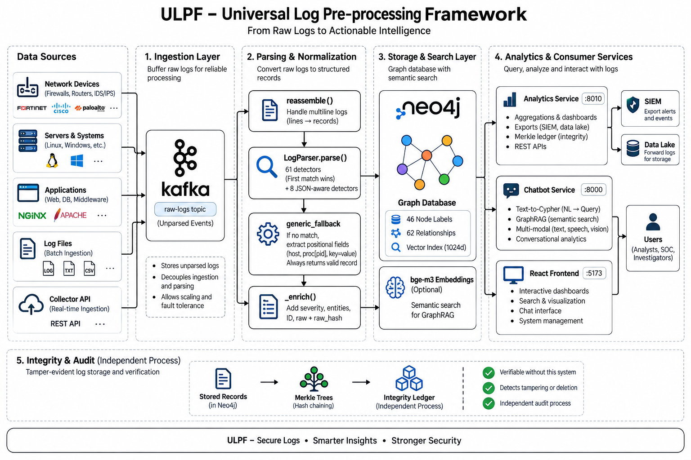

# ULPF — Architecture

**Universal Log Pre-processing Framework** · SIH 2026 · NTRO
Two pages. Everything stated here is in the repository and testable.

---

## 1. Shape of the system

Three independent services over one graph, plus a React frontend. They are
separate deployables on purpose: **ingestion writes, analytics and chat read,
and the integrity ledger audits storage from a process that did not write it.**



### Why raw is buffered *before* parsing

Kafka holds **unparsed** events. That only works because fetching and parsing
are separate processes, and the consequence is the one that matters: the parse
stage can crash, restart, or scale to several replicas without losing a log
that was already fetched.

The batch path has no Kafka — raw lives in the source file on disk. If parsing
fails there, the record still lands with `matched_format: generic_fallback` and
its raw intact. **Nothing is dropped in either path.**

### The parsing decision

```
record ──► looks like JSON? ──yes──► 8 JSON-aware detectors ──► structural reader
   │
   no
   ▼
61 detectors, priority order ──► first match wins
   │
   nothing matched
   ▼
generic_fallback ──► positional host (RFC 3164/5424), proc[pid], key=value,
                     binary guard. Always returns a schema-valid record.
```

**Detector order is the most fragile thing in the system.** A broad new format
placed too early takes lines from a specific one and *nothing fails* — the data
just gets quietly worse. This happened: adding `logfmt` silently claimed
FortiGate traffic logs, because Fortinet also emits `msg=`. Ten attribution
tests now pin which detector must claim which format.

`core/multiline.py` decides where one record ends and the next begins. Every
format with a detector needs a signature there, and the two lists must be kept
in step — a detector without one works only on files containing nothing else.

---

## 2. The universal event schema

**28 fields, 18 required**, each carrying its ECS name and OCSF path. Coverage
is measured against the live graph (`GET /api/analytics/schema/coverage`), so
the document can be proved wrong rather than merely asserted.

| Field | Purpose |
|---|---|
| `raw_message` | The original event, byte for byte |
| `raw_hash` | SHA-256 of those bytes |
| `id` | MD5-16 of `timestamp\|host\|process\|raw`, stable across re-ingestion |
| `matched_format` | Which detector claimed it |
| `confidence` | 1.0 vendor-specific → lower for shape matches and the fallback |
| `source_file` · `source_record` | Origin file and ordinal |
| `timestamp_source` | `event` or `ingest` |
| `timestamp_anomalous` | Clock-skew flag — **flagged, never corrected** |

Two decisions worth defending:

**`raw_hash` is verifiable without this system.** An investigator holding the
original log file can recompute SHA-256 over a line and find the matching
stored event — no ledger, no database, no need to trust us. That is what makes
it evidence rather than a checksum.

**Clock skew is flagged, not fixed.** 141 events in the development corpus are
stamped 2012 by an appliance with a dead RTC. Rewriting the timestamp would
make the normalised record disagree with the raw line, breaking the
losslessness guarantee. Analytics can exclude them; a SOC should arguably be
told, because a box with the wrong clock produces evidence that will not
correlate.

---

## 3. Tamper-evident ledger

Not a blockchain, and saying so would be overclaiming. The primitive underneath
one, where it earns its place.

```
event  ─► leaf   = SHA256(0x00 ‖ canonical(event))      RFC 6962 prefixes
leaves ─► root   = Merkle tree, odd nodes promoted (never duplicated)
block  ─► hash   = SHA256(header incl. prev_hash ‖ merkle_root)
blocks ─► chain  = each block commits to the previous
chain  ─► head   = the single value that must be protected
```

| Attack | Result |
|---|---|
| Edit a message | Caught — Merkle mismatch |
| Reorder or delete events | Caught |
| **Re-seal the block to hide the edit** | Caught — breaks the link to the next block |
| Re-seal the **entire** chain | **Not caught internally** — self-consistent; caught only by an externally held head |
| Forge an inclusion proof | Rejected |

- **RFC 6962 domain separation** — without distinct leaf/node prefixes an
  internal node can be replayed as a leaf (Merkle second-preimage attack).
- **Odd nodes promoted, not duplicated** — duplicating is what made Bitcoin's
  CVE-2012-2459 possible: two different trees yielding one root.
- **Nine fields sealed**, deliberately excluding `processed_at` and `embedding`,
  which change legitimately on re-parse. Sealing those would flag honest
  re-ingestion as tampering, and a control that cries wolf gets switched off.
- **9 sibling hashes** prove one event was in a 500-event block *without
  revealing the other 499* — which matters when the rest of the log is classified.

**Tamper-evident, not tamper-proof.** Publishing the head hash somewhere the
operator does not control is what turns evidence into proof, and is the one
place a real blockchain or an RFC 3161 timestamp authority would belong.

---

## 4. Onboarding an unseen source

```
unknown lines ─► tokenize into typed slots ─► group by shape ─► align
                                                                  │
                     literals = structure, varying slots = fields ─┘
                                        │
                                        ▼
              parser_semantics: what does each field MEAN?
                position (RFC 3164/5424 fix host and program slots)
                key name (vocabulary from the formats we already parse)
                value shape (ipv4, timestamp, severity word)
                                        │
                                        ▼
                        a runnable detector + per-field evidence
```

Measured on a vendor absent from the codebase: **3 ms**, and the generated
detector matched **4/4 lines with zero human edits**. It records the evidence
that named each field as a comment, so a reviewer can disagree with one
inference rather than distrust the file.

It will not guess whether an unnamed IP is source or destination. Putting wrong
evidence into an investigation is the failure this project exists to prevent.

---

## 5. Integration and deployment

**Pull** — streaming exports, flat memory: NDJSON · ECS · OCSF 1.3.0 · CEF · CSV
**Push** — syslog (RFC 5424 + RFC 6587 framing, CEF payload) · HTTP NDJSON
(Splunk HEC, Elastic, Sentinel) · rotating files for a lake.
Bounded queue, exponential backoff, dead-letter counter. Delivery is
**at-least-once**; deduplicate on the stable event `id`.

**Air-gapped.** Six Docker images, ~11.5 GB, `docker load` then
`docker compose up`. No runtime downloads, telemetry or licence checks —
verified with `docker run --network none`. Speech, vision and document
generation all run locally; there is no cloud API anywhere in the path.

**Configuration.** Each service reads its own `.env`, loaded by `config.py` so
*every* entry point honours it — not just the FastAPI app. Site-specific values
live in `.env.example`, never as defaults in code: a framework claiming to be
vendor-agnostic should not ship one customer's domain as its built-in
assumption.

---

## 6. Performance, and its limits

Intel i5-12450H, 8 cores, no GPU.

| | | Condition |
|---|---|---|
| 3,513 events/sec | normalisation | **1 core, parse stage only** |
| 16,826 events/sec | normalisation | 8 cores — 5.83× measured |
| 229 events/sec | parse + graph write | semantic search off |
| 3 events/sec | full pipeline | embedding is 94.5% of wall clock |

Parsing scales with **CPU cores**, not a GPU — the work is Python's `re`
engine, branchy backtracking over short strings, which does not vectorise.

**Where this breaks.** Neo4j is a correlation and investigation store, not a
log archive; at billions of events per day it will not hold, and the streaming
exports to a SIEM or data lake are the scale path rather than a nice-to-have.
Embedding on CPU is the pipeline bottleneck and is optional per deployment.
The live Kafka path has never run against production infrastructure.

We would rather state the boundary than be found at it.
